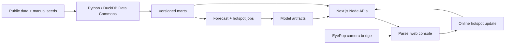

<p align="center">
  
</p>

<p align="center">
  <strong>Data-informed food relief for downtown San Diego.</strong><br />
  Forecast demand, verify conditions, allocate inventory, and learn from every mission.
</p>

<p align="center">
  <a href="#quick-start">Quick start</a> ·
  <a href="docs/ARCHITECTURE.md">Architecture</a> ·
  <a href="docs/HOTSPOT_MODEL_BENCHMARK.md">Model report</a> ·
  <a href="docs/DATA_COMMONS.md">Data Commons</a> ·
  <a href="docs/README.md">Documentation</a>
</p>

---

## Overview

Parsel is a food-bank operations and decision-support platform built for the
2026 Building for Good hackathon. It combines inventory management, San Diego
community data, explainable forecasting, 3D response planning, and human-reviewed
EyePop vision into one operational loop:

```text
understand context -> map a historical prior -> gather a field observation
  -> update the model -> optimize allocation -> complete a human-led distribution
```

The repository contains three integrated systems:

| System | Responsibility | Main paths |
|---|---|---|
| Parsel web platform | Operations UI, APIs, allocation, mapping and vision workflows | `src/`, `public/` |
| Data Commons | Reproducible ingestion, provenance, DuckDB marts and QA | `commons/`, `data/`, `seeds/`, `run.py` |
| Model pipeline | Neighborhood forecasting, block hotspot benchmarking and artifact generation | `ml/`, `marts/forecast_*`, `marts/hotspot_*` |

> **Project status:** Parsel is a working research/demo platform, not an autonomous
> delivery system. Inventory and live hotspot feedback currently use process/browser
> demo state. The latest block-level source snapshot is January 2025, so the UI marks
> those predictions stale. Historical-prior zones remain planning-only; only a
> zone touched by reviewed field evidence can enter the allocation workflow.

## Product capabilities

| Surface | What it does | Data mode |
|---|---|---|
| Landing | Presents source-linked San Diego impact statistics, then explains the sensing loop with a pinned Three.js mission concept | Public evidence + product narrative; not live telemetry |
| Dashboard | Stock KPIs and food-access need, with PIT, shelter, and parking kept as contextual signals | Demo operations + real aggregate data |
| Inventory | Search, filter, add and adjust food inventory with derived status | In-memory demo state |
| Donations | Record incoming items and update matching stock | In-memory demo state |
| Distributions | Record outgoing items and decrement stock | In-memory demo state |
| Response map | Render six movable model hotspots on a Mapbox 3D downtown map | Real marts + model artifacts |
| Allocation | Apply deterministic FEFO and proportional allocation to field-updated zones | Demo inventory + reviewed zone updates |
| Drone Ops | View the EyePop scene feed and apply one stabilized aggregate person count | Live bridge + adaptive hotspot state |

### What makes the loop adaptive

Parsel does not rely on one static heatmap. The offline block model initializes a
261-block visible-outreach intensity surface. It is not a direct measure of food
insecurity, eligibility, or meals required. An operator can select a field-check
target and apply one stabilized EyePop observation. The server updates nearby
Gamma-Poisson priors and recomputes all six hotspot centers immediately. Only the
zone containing that reviewed evidence becomes allocation-eligible; untouched
zones remain labeled as historical priors.

Repeated frames are never submitted automatically; doing so would count the same
visible people many times. The endpoint stores only the aggregate observation in
process memory. It stores no image, identity, face embedding, or person-level track.

The landing page opens with full-screen, source-linked evidence on San Diego
nutrition insecurity, the monthly meal gap, Food Bank service scale, and annual
food distribution. The pinned, scroll-controlled 3D mission scene then illustrates
the intended sensing route, aggregate observation, reviewed outreach-map update,
response optimization and return. The drone is an information-gathering input to
the model, not a food-delivery mechanism, and the scene is not live flight telemetry.
After the mission, the landing narrative continues through three operator chapters,
the adaptive feedback loop, the field-evidence allocation gate, explicit human-control
boundaries, and a direct path into the working demo.

## Architecture



The web request path never trains a model and does not require Python. Offline jobs
produce committed CSV, GeoJSON, and JSON artifacts. Next.js route handlers read
those artifacts, run embedded DuckDB queries, and expose client-safe responses.

Read [`docs/ARCHITECTURE.md`](docs/ARCHITECTURE.md) for container boundaries,
sequence diagrams, API contracts, security rules, limitations, and the recommended
PostgreSQL/PostGIS production evolution.

## Model strategy

Parsel uses two models because the product asks two different questions.

| Model | Question | Evaluation result |
|---|---|---|
| Pooled Ridge autoregression | How may neighborhood-level 311 request pressure change over the next three months? | MAE 20.55 vs 20.81 last-month baseline |
| Stacked block hotspot ensemble | Where may visible individuals concentrate at the next block observation? | MAE 1.789 vs 1.911 persistence; Poisson deviance 2.367 vs 11.223 |

The selected hotspot initializer is:

- 56.25% graph-diffusion gradient boosting;
- 18.75% recency-weighted spatial KDE; and
- 25% Tweedie XGBoost.

It won the balanced seven-metric ranking across 15 executable candidates. Pooled
Ridge had lower raw block MAE but underpredicted the total by 28.7%; spatial KDE
captured slightly more people in the top decile but was less calibrated. For food
allocation, the ensemble is the safer compromise across count error, rank, spatial
placement and total bias.

The newer 261-block panel produced a secondary four-fold MAE of 1.618 versus 1.690
for persistence, and Poisson deviance of 2.550 versus 12.424. Those metrics remain
available for technical review but are not presented as proof of current field
accuracy in the operator workflow.

Full Graph WaveNet, AGCRN, STAEformer, TFT, Neural CDE and DeepSTPP trials are gated
until regular high-frequency field observations exist. A large parameter count is
not evidence of accuracy on 50 historical whole-map snapshots.

See [`docs/HOTSPOT_MODEL_BENCHMARK.md`](docs/HOTSPOT_MODEL_BENCHMARK.md) for the
complete table and leakage controls.

## Quick start

### Requirements

- Node.js 20.9 or newer.
- npm.
- Optional: Python 3.11-3.13 for the Data Commons and models.
- Recommended: Python 3.12 for the EyePop camera bridge.
- Optional: a public Mapbox token and EyePop credentials.

### Run the web platform

```bash
npm install
cp .env.example .env.local
npm run dev
```

Open [http://localhost:3000](http://localhost:3000). Without a Mapbox token the
application still runs; the Delivery page shows setup guidance instead of the map.

Useful checks:

```bash
npm run typecheck
npm run lint
npm test
npm run check
npm run build:webpack
```

`build:webpack` is provided because some restricted development environments do
not allow Turbopack's internal worker to bind a local port.

### Configure the optional web integrations

`.env.local` uses the root `.env.example`:

| Variable | Required | Purpose |
|---|---|---|
| `NEXT_PUBLIC_MAPBOX_TOKEN` | No | Public browser token for the 3D delivery map |
| `EYEPOP_API_KEY` | For camera detection | Server-only key for one-shot delivery-zone EyePop captures |

Keep `EYEPOP_API_KEY` in `.env.local` for the browser capture API and in
`scripts/.env` for the optional live bridge; never prefix a secret with `NEXT_PUBLIC_`.

### Run the optional EyePop drone bridge

The Drone Ops camera feed is a separate local Python adapter:

```bash
python3.12 -m venv .venv-vision
source .venv-vision/bin/activate
python -m pip install -r scripts/requirements.txt
cp scripts/.env.example scripts/.env
# Add EYEPOP_API_KEY to scripts/.env
python scripts/eyepop_bridge.py
```

The bridge serves the annotated MJPEG stream and latest aggregate detection at
`http://127.0.0.1:8091`. `VIDEO_SOURCE` can point to a local video or URL when a
webcam is unavailable.

### Build or refresh the Data Commons

```bash
python3 -m venv .venv-data
source .venv-data/bin/activate
python -m pip install -r requirements.txt

npm run data:build
npm run data:refresh
python -m pytest -q
```

`data:build` runs the complete source pipeline. `data:refresh` updates the
auto-refreshing 311, enforcement and parking sources, then rebuilds the marts and
generated QA documentation.

### Rebuild model artifacts

```bash
python -m pip install -r ml/requirements.txt

npm run model:forecast
npm run model:benchmark
npm run model:build
```

The benchmark must run before the production hotspot job when model selection or
weights change. Generated artifacts are committed so the console remains
reproducible without a Python runtime.

## API reference

| Method | Route | Description |
|---|---|---|
| `GET` | `/api/commons` | Dashboard PIT and shelter summaries |
| `GET` | `/api/forecast` | Neighborhood 311 history, forecast and model card |
| `GET` | `/api/zones` | Current planning surface and model metadata |
| `POST` | `/api/hotspots/observe` | Assimilate one aggregate field observation |
| `GET` | `/api/elevation` | Resolve elevation for a custom map point |
| `GET/POST` | `/api/eyepop/detect` | Warm or run common-object detection |

Example hotspot update:

```bash
curl -X POST http://localhost:3000/api/hotspots/observe \
  -H 'content-type: application/json' \
  -d '{
    "lat": 32.7097,
    "lng": -117.1545,
    "count": 42,
    "confidence": 0.88,
    "coverage": 0.90,
    "radiusKm": 0.18
  }'
```

## Repository structure

```text
src/app/              Next.js pages and route handlers
src/components/       Reusable product UI
src/context/          Demo inventory/donation/distribution state
src/lib/              Domain logic and server adapters
commons/              DuckDB ingestion, staging, marts and QA
ml/                   Forecast, benchmark and artifact-generation jobs
scripts/              EyePop bridge and data utilities
data/hackathon/       Mandatory committed Source H bundle
seeds/                Traceable manual/crosswalk inputs
marts/                Versioned runtime data and model artifacts
docs/                 Architecture, model, data and provenance documents
tests/                Python data/model tests
```

## Data responsibility

The Data Commons contains observations and contextual signals with different
meanings and biases. Only specific sources represent counted units; 311 requests,
parking sessions, citations, shelter capacity, weather and rent are proxies or
context. Parsel never sums those fields into a synthetic headcount.

Block-level exports are treated as internal because small-area counts combined
with public geometry can reveal sensitive locations. Client-level data, names,
free-text 311 descriptions and personal identifiers do not belong in the marts.

Read [`docs/DATA_COMMONS.md`](docs/DATA_COMMONS.md), the generated
[`DATA_DICTIONARY.md`](DATA_DICTIONARY.md), and [`QA_REPORT.md`](QA_REPORT.md)
before citing any value.

## Operational and safety boundaries

- Inventory, donations and distributions reset on a full page reload.
- Live hotspot observations reset when the Node process restarts and are not shared
  across multiple server instances.
- Allocation currently treats heterogeneous packages as generic units. Production
  packing requires servings, mass, volume, temperature and transport constraints.
- Staging an allocation decrements demo inventory; it is not proof of loading,
  delivery, uptake or partner confirmation.
- Drone Ops uses selected target coordinates, not flight-controller GPS or a
  calibrated camera footprint.
- Vision output is an operator aid. A person must approve observations, sensing
  missions, response recommendations, dispatch and distribution completion.
- Do not infer homelessness from appearance, perform face recognition, or treat a
  visible-person estimate as identity, consent, eligibility, or a complete census.
- Real sensing flights require site-specific legal, airspace, safety, privacy and
  insurance review.

The prioritized production roadmap is maintained in
[`docs/HOTSPOT_DRONE_CONTEXT.md`](docs/HOTSPOT_DRONE_CONTEXT.md).

## Documentation

- [`docs/ARCHITECTURE.md`](docs/ARCHITECTURE.md): current and target architecture.
- [`docs/HOTSPOT_DRONE_CONTEXT.md`](docs/HOTSPOT_DRONE_CONTEXT.md): engineering handoff.
- [`docs/HOTSPOT_MODEL_BENCHMARK.md`](docs/HOTSPOT_MODEL_BENCHMARK.md): model evidence.
- [`docs/DATA_COMMONS.md`](docs/DATA_COMMONS.md): pipeline and interpretation guide.
- [`docs/DATA_SOURCE_CATALOG.md`](docs/DATA_SOURCE_CATALOG.md): 58-source expansion catalog.
- [`docs/hackathon/PROVENANCE.md`](docs/hackathon/PROVENANCE.md): mandatory dataset provenance.
- [`docs/README.md`](docs/README.md): documentation index.

## Technology

Next.js 16 · React 19 · TypeScript · Tailwind CSS 4 · Recharts · Mapbox GL ·
DuckDB · Python · pandas · scikit-learn · XGBoost · EyePop.ai · Vitest · pytest

---

Built for food banks and the people they serve. Parsel supports operator judgment;
it does not replace outreach expertise, food-safety review, or responsible flight
operations.
