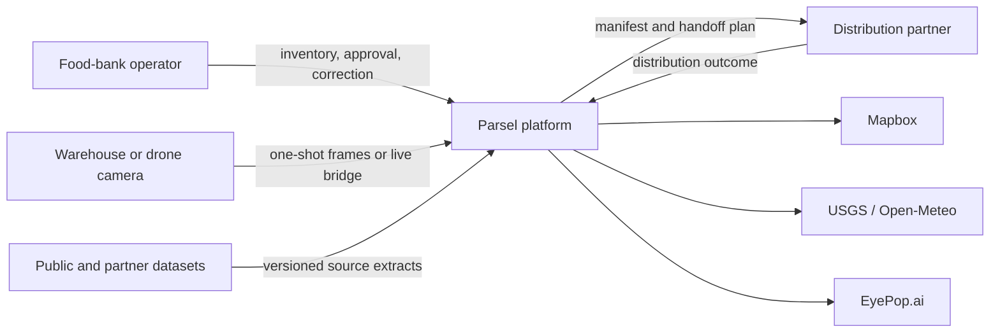
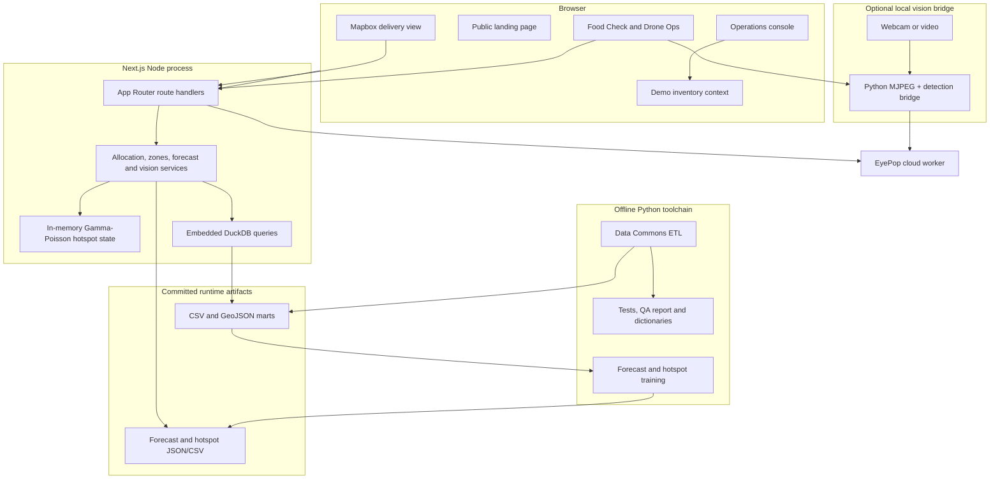
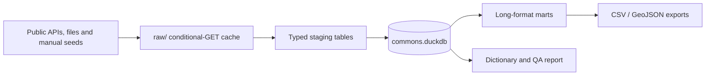
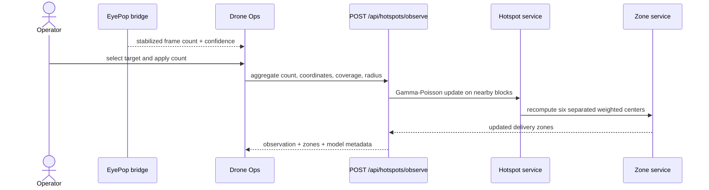
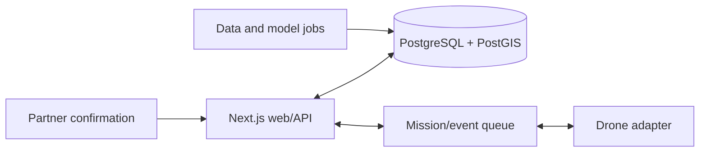

# Parsel system architecture

This document describes the architecture implemented in this repository and the
recommended production evolution. It intentionally distinguishes working demo
capabilities from future infrastructure.

## Architecture goals

Parsel is designed around five principles:

1. **Close the operational loop.** A prediction must connect to inventory,
   field verification, allocation, and an auditable outcome.
2. **Keep decisions explainable.** Operators should be able to see why a zone
   moved and why a quantity was recommended.
3. **Treat signals honestly.** Complaints, parking activity, and enforcement are
   contextual proxies, never person counts.
4. **Keep people in control.** Vision suggests; operators approve food-safety,
   mission, and handoff decisions.
5. **Separate offline learning from online feedback.** Reproducible Python jobs
   produce versioned model artifacts; small live updates do not require Python
   in the web request path.

## System context



## Current container architecture



### Runtime boundaries

| Layer | Responsibilities | Current implementation |
|---|---|---|
| Presentation | Navigation, forms, charts, maps, camera views and operator feedback | `src/app`, `src/components`, `src/context` |
| Domain | Inventory arithmetic, FEFO allocation, geographic helpers and observation rules | Pure modules under `src/lib` |
| Server services | DuckDB reads, model-artifact loading, hotspot assimilation, elevation and EyePop adapters | Server-only imports used by `src/app/api` |
| Data platform | Source ingestion, provenance, normalization, marts, QA and exports | `commons`, `run.py`, `refresh.py` |
| Model platform | Forecasting, leakage-safe benchmarking, production artifact generation | `ml` |
| Edge adapter | Local webcam/video capture, MJPEG serving and EyePop person inference | `scripts/eyepop_bridge.py` |

Client components never import DuckDB, filesystem, credentials, or model-training
code. Route handlers form the browser-to-server boundary. The web runtime consumes
committed artifacts, so a Python environment is not needed to run the console.

## Core data flows

### 1. Build the data commons



Every source registers its grain, signal type, URL, refresh cadence, measures,
and known bias. Source-specific normalization stays in `commons/staging`; common
unions and export policy stay in `commons/marts.py`.

### 2. Produce model artifacts

Two models answer different questions:

| Model | Question | Runtime artifact |
|---|---|---|
| Pooled Ridge 311 forecast | How may neighborhood request pressure change over the next three months? | `marts/forecast_monthly.csv`, `marts/forecast_meta.json` |
| Stacked block hotspot ensemble | Where may visible counts concentrate at the next block-level observation? | `marts/hotspot_blocks.json`, `marts/hotspot_zones.json` |

The hotspot initializer is a fixed blend of graph-diffusion gradient boosting,
spatial KDE, and Tweedie XGBoost. Its weights were selected before the reported
test folds. See `HOTSPOT_MODEL_BENCHMARK.md` for the evidence and limitations.

### 3. Assimilate live field feedback



Repeated video frames are never submitted automatically. Current demo state is
held in one Node process and resets on restart. No image, face, embedding, or
person-level track is stored by the hotspot endpoint.

### 4. Allocate food

The allocation service is deterministic:

1. Convert zone need to demand using an operator-controlled units-per-person
   factor.
2. Sort available items by expiration date (FEFO).
3. Split each item proportionally to remaining zone demand with
   largest-remainder rounding.
4. Stop when demand is covered or stock is exhausted.

The existing inventory uses heterogeneous demo units. Production allocation must
normalize servings, weight, volume, temperature class, and payload eligibility.

## API surface

| Method | Route | Purpose | Runtime |
|---|---|---|---|
| `GET` | `/api/commons` | Dashboard public-data summaries | Node + DuckDB/files |
| `GET` | `/api/forecast` | Neighborhood 311 history and forecast | Node + committed marts |
| `GET` | `/api/zones` | Model-derived hotspots plus contextual signals | Node + DuckDB/files |
| `POST` | `/api/hotspots/observe` | Assimilate one aggregate field observation | Node, mutable process state |
| `GET` | `/api/elevation` | Resolve ground elevation for a map point | Node + external fallback |
| `GET/POST` | `/api/eyepop/detect` | Warm and run one-shot common-object detection | Node + EyePop |
| `GET/POST` | `/api/eyepop/food` | Warm and run food-quality inference | Node + EyePop |

All dynamic routes use the Node runtime. `@duckdb/node-api` and the EyePop SDK
remain external packages because they should not be bundled into browser code.

## Data contracts

### Hotspot observation

```ts
interface HotspotObservationInput {
  lat: number;
  lng: number;
  count: number;
  confidence?: number; // 0 < confidence <= 1
  coverage?: number;   // 0.05 <= coverage <= 1
  radiusKm?: number;   // 0.03 <= radiusKm <= 2
  observedAt?: string;
}
```

The production contract should additionally require `missionId`, detector
version, altitude, camera footprint geometry, deduplication window, and optional
human-corrected count.

### Delivery zone

A zone combines a model-derived center and predicted count with contextual
neighborhood signals. `requests`, `tents`, `vehicles`, and enforcement counts
are explanatory context; they are not added together as people.

### Model metadata

Every artifact includes model name, component weights, source date, target month,
generation date, stale-source warning, and backtest summary. The UI carries that
metadata to the operator instead of presenting an unqualified number.

## Security, privacy and safety

- Keep `EYEPOP_SECRET_KEY` and bridge credentials server-side. Only the public
  Mapbox token may use a `NEXT_PUBLIC_` name.
- Validate coordinates, counts, confidence, coverage, timestamps, image encoding,
  and request sizes at route boundaries.
- Restrict the local bridge to approved localhost origins.
- Store aggregate observations, not identities or face-derived attributes.
- Minimize raw-video retention and document any operational retention separately.
- Require human approval for food rejection, mission launch, payload release, and
  distribution completion.
- Do not infer homelessness from appearance or equate a visible-person estimate
  with consent, eligibility, or a complete population count.
- Real flights require site-specific legal and safety review; simulation remains
  the default when those prerequisites are absent.

## Current limitations

| Area | Current state | Production requirement |
|---|---|---|
| Inventory | React process/browser demo state | Durable transactional inventory and lot ledger |
| Hotspot feedback | Single-process memory | Shared observation store and idempotent updates |
| Missions | Operator-selected target; no flight-controller feed | Mission state machine and telemetry adapter |
| Routing | Straight depot-to-zone spokes | Approved route planning, constraints and geofencing |
| Vision count | Single stabilized frame | Calibrated tracking/deduplication and coverage model |
| Food quality | Vision suggestion | Auditable quarantine and human disposition workflow |
| Allocation units | Heterogeneous generic quantities | Servings, mass, volume, temperature and payload constraints |
| Model freshness | Latest block panel ends January 2025 | Regular field observations and scheduled retraining |

## Recommended production evolution



1. Introduce PostgreSQL/PostGIS repositories behind the existing inventory,
   mission, observation, and zone service boundaries.
2. Add idempotent mission and observation IDs before accepting automated feeds.
3. Persist the full forecast-to-outcome funnel: predicted, verified, approved,
   loaded, delivered, taken, returned, and wasted.
4. Run data refresh and model generation as versioned jobs; promote artifacts only
   after forward-time and held-out-location evaluation.
5. Add real GPS, altitude, footprint, battery, link-health, and handoff events via
   a replaceable drone adapter.
6. Evaluate Graph WaveNet/AGCRN on regular sequences or Neural CDE on irregular
   events only after enough field data exists.

## Dependency rules

- UI modules may depend on client-safe domain types and pure functions.
- Route handlers may depend on server services and adapters.
- Server services may read committed marts but may not import UI modules.
- Offline Python may write versioned artifacts but is never invoked from a web
  request.
- External-provider details stay behind `zones`, `eyepop`, or bridge adapters.
- Pure allocation and validation logic should remain independently unit-testable.

These rules keep the current demo easy to run while preserving clear seams for a
durable production backend.
