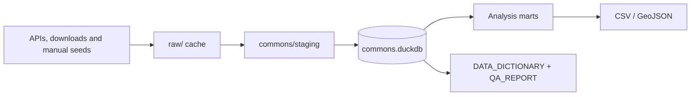

# San Diego Homelessness Data Commons

The Data Commons is Parsel's reproducible Python/DuckDB pipeline for combining
San Diego homelessness observations with complaint, enforcement, capacity,
weather, housing, food-access, and mobility signals.

> This is a collection of signals with documented biases, not a census. Never
> report complaints, citations, parking activity, shelter capacity, or model
> output as a direct count of people.

## Pipeline



Source-specific parsing is isolated under `commons/staging`. `commons/marts.py`
unifies the normalized tables into long-format monthly and daily marts. Every
registered source and table includes provenance, grain, cadence, measures, and
known bias.

## Source inventory

| ID | Source | Signal class | Refresh |
|---|---|---|---|
| A | Downtown block-level street counts | Observation | Static archive |
| B | DSDP monthly report totals | Observation | Manual/PDF fallback |
| C | Get It Done 311 homelessness-related requests | Complaint proxy | Daily |
| D | 72-hour reports and selected parking citations | Enforcement proxy | Daily/annual |
| E | City/SDHC shelter capacity | Capacity | Manual/PDF |
| F | Regional Task Force annual Point-in-Time counts | Observation | Annual |
| G | NOAA weather, Zillow rent and policy events | Context | Mixed |
| H | Data Science Alliance hackathon DSDP bundle | Observation | Static committed bundle |
| I | USDA Food Access Research Atlas for La Jolla | Food-access context | Periodic |
| J | Downtown paid-parking transactions | Activity proxy | Daily files |

The broader acquisition backlog covers 58 researched sources in
`DATA_SOURCE_CATALOG.md` and `data_source_catalog.csv`.

## Build and refresh

```bash
python3 -m venv .venv
source .venv/bin/activate
python -m pip install -r requirements.txt

python run.py
python refresh.py
python -m pytest -q
```

`run.py` initializes the schema, loads all configured sources, rebuilds marts,
exports files, and regenerates the dictionary and QA report. Downloads use a
conditional-GET cache under `raw/`.

`refresh.py` is the smaller recurring path. It refreshes 311, enforcement, and
parking activity before rebuilding the derived outputs. Manual, annual, and
static sources retain their last loaded versions.

## Runtime outputs

| Artifact | Audience | Purpose |
|---|---|---|
| `commons.duckdb` | Internal | Staging tables, lineage metadata and marts |
| `marts/monthly_by_neighborhood.csv` | Shareable aggregate | Month × neighborhood × metric |
| `marts/monthly_by_block.csv` | Internal | Month × block × metric |
| `marts/daily_downtown.csv` | Internal | Day × neighborhood × metric |
| `marts/blocks.geojson` | Internal mapping | Census-block geometry |
| `marts/food_access_la_jolla.csv` | Shareable aggregate | USDA FARA tract and area metrics |
| `marts/parking_activity_daily.csv` | Shareable aggregate | Daily neighborhood parking activity |
| `marts/parking_activity_monthly.csv` | Shareable aggregate | Monthly neighborhood parking activity |
| `DATA_DICTIONARY.md` | Engineering/analysis | Generated schema, lineage and caveats |
| `QA_REPORT.md` | Engineering/analysis | Generated load coverage and quality checks |

Block-level exports are internal because combining small-area counts with public
geometry can expose sensitive encampment locations. No client-level or personally
identifying data belongs in any mart.

## Mandatory hackathon dataset

The committed Source H bundle in `data/hackathon/` contains:

- DSDP monthly adjusted downtown totals, 2017-2025.
- Digitized block-level individuals, tents/structures, and vehicles for 12 count
  dates from 2018-2025.
- Downtown block-grid CSV and GeoJSON files.
- Area crosswalk and occupancy-multiplier periods.

Read `hackathon/PROVENANCE.md`, `hackathon/DATA_DICTIONARY_hackathon.md`, and
`hackathon/METHODOLOGY_CHANGELOG.md` before comparing periods. Important breaks
include occupancy multipliers, footprint expansion, variable counting effort, and
unreported months.

## Critical interpretation rules

1. **Adjusted and raw counts are different.** DSDP reported totals use occupancy
   multipliers for tents and vehicles. Do not add or directly compare them to raw
   digitized components without labeling the methodology difference.
2. **Source A includes three imputed months.** They are flagged and excluded from
   model test folds.
3. **311 coverage changes over time.** Relevant categories become reasonably
   comparable only around August 2018.
4. **Source H has reporting gaps.** Four 2025 months are absent, not zero.
5. **Parking is activity, not foot traffic.** It misses every non-paid-parking mode
   and changes with prices, enforcement, meter coverage and travel behavior.
6. **PIT is a one-night estimate.** It is useful as an annual anchor and still has
   known undercount and methodology limitations.

## Manual seeds

The `seeds/` directory contains traceable inputs for sources that cannot be fully
automated. Each row should retain a source URL and a note sufficient for review.

| Seed | Purpose |
|---|---|
| `gid_service_map.csv` | Versioned inclusion map for changing 311 categories |
| `violation_codes.csv` | Citation-code classification and interpretation |
| `dsdp_manual.csv` | Verified fallback for genuinely missing DSDP months |
| `capacity_manual.csv` | Shelter roster and occupancy transcription |
| `pit_annual.csv` | Annual PIT totals |
| `events.csv` | Dated policy/service context |
| `food_access_la_jolla.csv` | Generated USDA FARA tract metrics |
| `parking_area_map.csv` | Lower-confidence spatial fallback for historic meters |

## Further documentation

- `../DATA_DICTIONARY.md` — generated table and column reference.
- `../QA_REPORT.md` — generated quality and coverage report.
- `DATA_SOURCE_CATALOG.md` — acquisition roadmap and proxy mapping.
- `hackathon/PROVENANCE.md` — Source H chain of custody.
- `ARCHITECTURE.md` — how the commons feeds the product and models.
