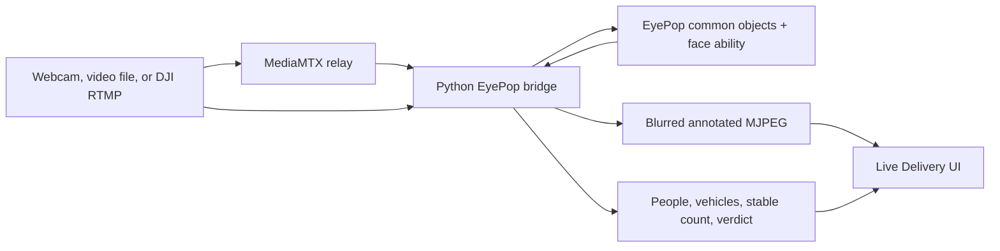
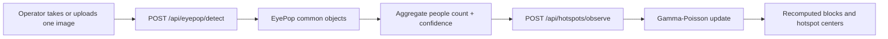

# EyePop pipeline

This document is the source of truth for how EyePop is used in Parsel today.
The product has two EyePop paths. Both work, but they are not yet one automatic
pipeline.

## Current architecture



The bridge runs on `127.0.0.1:8091`. It keeps capture and inference in separate
loops so the displayed video can continue at camera speed while EyePop inference
runs at cloud round-trip speed.

The model update path is separate:



## Continuous bridge path

The bridge is implemented in `scripts/eyepop_bridge.py`.

### Input sources

- Webcam selected by `CAMERA_INDEX`.
- Local video file selected by `VIDEO_SOURCE`.
- Network stream such as `rtmp://localhost:1935/drone` selected by
  `VIDEO_SOURCE`. A live stream is reconnected when it drops and is never looped.
- DJI Fly can publish RTMP to the MediaMTX configuration in
  `scripts/mediamtx.yml`. See `docs/DRONE_RTMP_SETUP.md`.

### EyePop abilities

The default scene ability is `eyepop.common-objects:latest` with a confidence
threshold of 0.5. The bridge also requests
`eyepop.person.face.short-range:latest` for privacy regions. If the face ability
is unavailable, person head regions are used as a fallback.

### Returned telemetry

`GET http://127.0.0.1:8091/detection` returns the latest:

- people count and person boxes;
- all detected common objects;
- vehicle boxes and vehicle count;
- maximum person confidence;
- low-median stable people count;
- measured video and inference rates;
- frame brightness;
- GO, HOLD, or NO-GO drop-zone verdict;
- face blur mode and current blurred-region count;
- source kind, label, and live or recorded status;
- bridge boot ID and timestamp; and
- rolling session statistics.

`GET /stream.mjpg` serves the annotated operator view. `GET /frame.jpg` serves
one current annotated frame.

### Stabilization

`scripts/vision_stats.py` keeps the last five inference counts and exposes their
low median as `stable_people`. This rejects a single high spike from becoming the
displayed stable count. It is telemetry only today. The dispatch workflow does
not automatically submit it as model evidence.

`src/lib/observationGate.ts` contains a tested occupancy-episode gate. It can arm
after repeated identical nonzero stable counts, fire once, wait for a clear run,
and enforce a cooldown. It is not connected to the live dispatch page yet.

### Drop-zone verdict

`scripts/drop_verdict.py` evaluates operational drop safety, not food need.

1. A dark or covered camera returns NO-GO.
2. Detections intersecting the configured center zone are treated as hazards.
3. Hazard class and confidence determine a safety score.
4. Any hazard returns HOLD.
5. The zone must remain clear for the configured hold period, three seconds by
   default, before GO is returned.

The verdict is advisory. It does not command a flight controller or release a
payload.

## Reviewed one-frame path

`src/components/DeliveryObservationPanel.tsx` is the model-updating path used by
Live Delivery.

1. The mission reaches its observing phase.
2. The browser requests camera access, or the operator uploads a JPEG, PNG, or
   WebP image.
3. The operator presses the capture button.
4. `POST /api/eyepop/detect` sends one JPEG to a server-only transient EyePop
   worker using `eyepop.common-objects:latest`.
5. Parsel filters the returned objects to people and uses the maximum person
   confidence.
6. `POST /api/hotspots/observe` receives count, confidence, timestamp, mission
   coordinates, estimated coverage, and radius.
7. Nearby block priors update and the current hotspot zones are recomputed.
8. The mission UI shows need before, need after, and affected block count.

The image is displayed only in the current browser component state. It is not
written to the hotspot observation log. The server and EyePop necessarily hold
the request bytes transiently while inference runs.

## Privacy and interpretation boundaries

The continuous bridge sends the raw frame to EyePop so detection quality is not
reduced, then blurs face or fallback head regions in the copy served to the
operator. Face detections do not appear in the public object chips or count.

An accepted model observation persists only aggregate operational fields:

- count;
- confidence;
- coordinates;
- coverage and radius;
- observation time; and
- affected block metadata.

Parsel does not persist identity, face embeddings, person-level tracks, or a
person-level image record. A visible person count must not be interpreted as
homelessness, food insecurity, eligibility, consent, or a complete census.

## What is not connected yet

- The continuous bridge does not automatically call `/api/hotspots/observe`.
- The tested occupancy gate is not mounted in the dispatch workflow.
- Bridge detections are not georeferenced with a calibrated camera footprint.
- The safety verdict does not control a real drone or payload release.
- The UCSD replay interpolates its route because the source clip has no
  per-frame GPS track.

The recommended next integration is an operator review card that receives one
gated bridge episode, attaches real flight-controller location plus calibrated
coverage, and requires explicit approval before submitting the aggregate count.
This preserves the no-repeat guarantee without making live telemetry autonomous.

## Run the live bridge

```bash
python3.12 -m venv .venv-vision
source .venv-vision/bin/activate
python -m pip install -r scripts/requirements.txt
cp scripts/.env.example scripts/.env
# Add EYEPOP_API_KEY to scripts/.env
python scripts/eyepop_bridge.py
```

For a DJI RTMP source, follow `docs/DRONE_RTMP_SETUP.md`.

## Main implementation files

| File | Responsibility |
|---|---|
| `scripts/eyepop_bridge.py` | Capture, cloud inference, face blur, MJPEG, telemetry |
| `scripts/drop_verdict.py` | Visibility, zone, severity, and clear-hold verdict |
| `scripts/vision_stats.py` | Stable count and session statistics |
| `scripts/privacy.py` | Padded face and fallback head-region geometry |
| `src/lib/droneVision.ts` | Browser polling and bridge payload mapping |
| `src/components/DroneDispatchFeed.tsx` | Live bridge visualization |
| `src/components/DeliveryObservationPanel.tsx` | Operator-triggered one-frame capture |
| `src/app/api/eyepop/detect/route.ts` | Server-side EyePop one-shot API |
| `src/lib/eyepop.ts` | Cached transient EyePop worker adapter |
| `src/app/api/hotspots/observe/route.ts` | Aggregate observation API |
| `src/lib/hotspotState.ts` | Gamma-Poisson update and hotspot recomputation |
| `src/lib/observationGate.ts` | Tested, not-yet-integrated episode gate |
